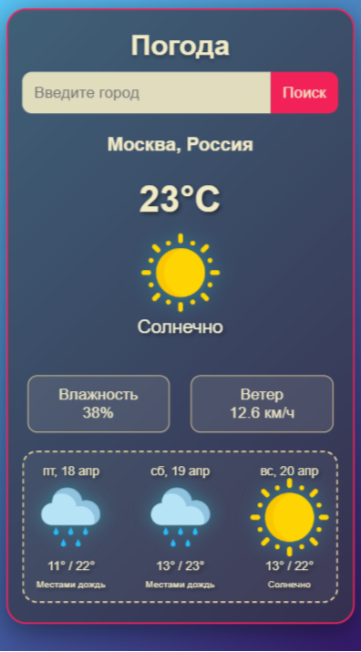

# ссылка на сайт: [https://larawagner008.github.io/WeatherApp/](https://larawagner008.github.io/WeatherApp/)

# 🌦️ WeatherApp - Прогноз погоды

Приложение для просмотра текущей погоды и прогноза на 3 дня в любом городе мира.

## 🚀 Особенности

- Текущая погода с детализацией (температура, влажность, ветер)
- Прогноз на 3 дня с иконками
- Автодополнение при поиске городов
- Адаптивный дизайн для разных устройств

## 🛠️ Технологии

- **API**: WeatherAPI.com
- **Frontend**: HTML5, CSS3, JavaScript (ES6+)
- **Адаптивность**: CSS Media Queries, Flexbox, Grid
- **Иконки**: flaticon.com
